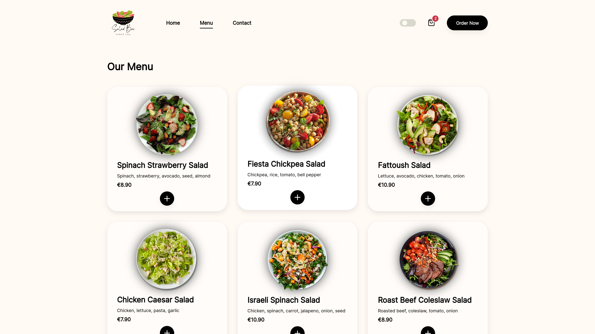

# Restaurant Page

A simple restaurant page for a ficticious salad bar. It utilizes Webpack for module bundling and was created as part of The Odin Project's [curriculum](https://www.theodinproject.com/lessons/node-path-javascript-restaurant-page).

### [Live Demo](https://emuel-vassallo.github.io/restaurant-page/)

## Showcase

### Home

#### Light Theme

#### Dark Theme

### Menu

#### Light Theme

#### Dark Theme

### Contact

#### Light Theme

#### Dark Theme

## Built With

- HTML
- CSS
- JavaScript
- Webpack

## Features

- Fluid animations
- Smooth hover effects
- Simple and minimal UI

## TODO

- [ ] Fly the image of the item just added to cart to the cart icon in the header

## Credits and Inspiration

### Assets

- [Logo](https://www.canva.com/p/templates/EAEvwBcKXbI-black-green-red-salad-bar-logo/)
- [Icons](https://feathericons.com/)
- [PNGs](https://www.pngwing.com/)

### Designs

- [Food landing page](https://dribbble.com/shots/16187552-Madang-Food-Landing-Page) by [Arki Rachman](https://dribbble.com/arkirachman)
- [Food delivery service design](https://www.behance.net/gallery/140356355/Food-delivery-service-Web-UI) by [Anupam Ghosh](https://www.behance.net/anupamghosh1)
- [Food app concept](https://dribbble.com/shots/15698078-Food-app-concept) by [Fatemeh Rashno](https://dribbble.com/fateme_rsn)
- [Restaurant food items with delivery](https://dribbble.com/shots/16761021-Restaurant-food-items-with-delivery) by [Md Yeasin Arafat](https://dribbble.com/gmdyeasinarafat)
- [Restaurant page project](https://github.com/nekusu/restaurant-page) by [Nekusu](https://github.com/nekusu)
- [IT Soft (Contact Us Page Design)](https://www.behance.net/gallery/111310951/IT-Soft-%28Contact-Us-Page-Design%29?tracking_source=search_projects%7Ccontact%20page) by [Jonaidul Islam](https://www.behance.net/jonaidislam)
